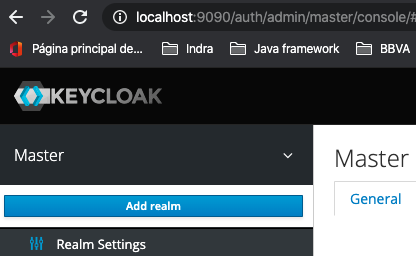

### Running

```
# Running
% docker-compose -f "docker-compose.keycloak-postgres.yml" -p keycloak_registry_tuto up -d 

# Stopping containers and cleaning
% docker-compose -p keycloak_registry_tuto down 
```

To see what is currently running:

```
% docker-compose -p keycloak_registry_tuto ps 
% docker-compose -p keycloak_registry_tuto logs -f keycloak 
```

### Welcome to Keycloak

Server will startup and on port 9090. 

http://localhost:9090/auth/

### Log in to the Admin Console

Click the Administration Console link on the Welcome page or go directly to the console URL

http://localhost:9090/auth/admin/

```
KEYCLOAK_USER: admin
KEYCLOAK_PASSWORD: Pa55w0rd
```

### Importing a Keycloak Realm at Admin console

Import the JSON file found in above GIT repo (keycloak/config)

https://www.keycloak.org/docs/latest/server_admin/#admin-console-export-import

https://hub.docker.com/r/jboss/keycloak/

Import quickstart-realm.json into your Keycloak. To do that, go to the Keycloak admin console (http://localhost:9090/auth/admin/) and select "Add realm" and then select the JSON file. It creates `Spring-boot-quickstart` realm.



It will create realm, clients, roles and users for you (Demo purpose). You can create them manually as you wish.

- [Admin REST API](https://www.keycloak.org/docs/latest/server_development/#admin-rest-api)

